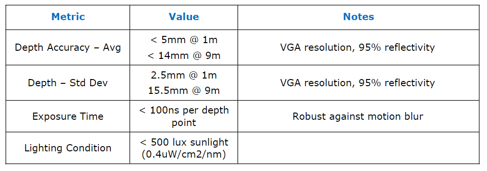

# RealSense L515 摄像头

[L515官网链接](https://www.intelrealsense.com/zh-hans/lidar-camera-l515/) ;[L515参数文档](https://www.intelrealsense.com/download/7691/)

基本信息摘录：

深度：每个像素值代表与相机距离的值。

视场：视场（FOV）描述了由摄像机成像的给定场景的角度范围。 

IR Laser：用于照亮场景，物体或人以收集深度数据的红外（IR）光源。

IMU：惯性测量单元，用于检测3维加速度和3维旋转。

LiDAR：光检测和测距是一种遥感技术，它结合使用激光和接收器来测量到物体和目标的距离。

MEMS：微机电系统

## 深度相机规格

## 彩色相机规格

## IMU规格

## RealSense SDK
https://www.intelrealsense.com/zh-hans/sdk-2/

## 测评博客与视频
[测评的博客](https://blog.cavedu.com/2020/08/24/intel-realsense-l515-2/)

[开箱视频](https://www.youtube.com/watch?v=4zUOmXFZK-k)

[实现目标识别与追踪](https://www.youtube.com/watch?v=eeKkrWj55Bg)

[视频：使用Intel RealSense L515光达相机进行房间扫描](https://www.youtube.com/watch?v=41Yu2H9_z3w)

[视频：对比Intel RealSense L515 与 D435i](https://www.youtube.com/watch?v=us_7SS8hZMo)

[视频：对比 Intel RealSense L515 与 Microsoft Azure Kinect depth sensors ](https://www.youtube.com/watch?v=RBDfABrNKz8)

[视频：户外场景测试](https://www.youtube.com/watch?v=tUINGnlHOXY)

## 他人的调试经验

[配置L515的博客(1)](https://blog.csdn.net/zhuyonggan/article/details/107548001)

[配置L515的博客(2)](https://blog.csdn.net/zhuyonggan/article/details/107945393)

[配置L515的博客(3)](https://blog.csdn.net/zhuyonggan/article/details/107975274)

[github上一个基于L515的SLAM项目](https://github.com/wh200720041/FLOAM_ssl)
